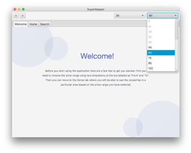
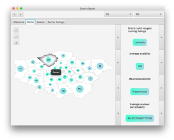

# Hack King's 4.0: Hackathon

## Team SuperMapper:
Members: Oluwafemi Oladipo (myself); Kim-Anh Vu; Julia Jakubiak; Szymon Sudol; Aleksandar Bonin

## Brief
Aim: create an application that helps users with slow or unreliable internet connections, have access to internet services.

Result: A desktop application that allows users to access AirBnb services without an internet connection, by storing updated listing data localy whenever a reliable internet connection is established.

Welcome Screen                               |  Map of Listings
:-------------------------------------------:|:--------------------------------------------:
  |  
